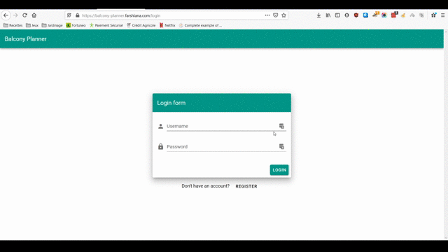

# balcony-planner

## Demo


Wanna try the app? It's [right here](https://balcony-planner.farshiana.com)!

## How the app works
* Users must authenticate with an existing account or create one
* Administrators can manage plant varieties that will be accessible to all users
* Users can add those varieties to their list of plants
* Users can add planters to their balcony
* Users can add plants to their planters
* Users can see the planning for their balcony

## Technologies
* Vue.js with Vuex
* UI components from Vuetify
* Form validation with Vuelidate
* Native drag & drop
* Resize with croppie
* Testing with Jest
* Linter with ESLint
* Error tracking with Sentry
* Hosted with AWS (S3, Route53, Cloudfront)
* CI/CD with CircleCI

## Project setup
### Installs dependencies
```
yarn install
```

### Compiles and hot-reloads for development
```
yarn serve
```

### Compiles and minifies for production
```
yarn build
```

### Run your unit tests
```
yarn test:unit
```

### Lints and fixes files
```
yarn lint
```

### Environment variables
Simply copy the .env.sample file in a new .env file

## Next steps
Obviously, the whole app has already taken quite some time.
However, there are still lots of things to improve. For example:
* The app is partially tested
* Great features could be added
